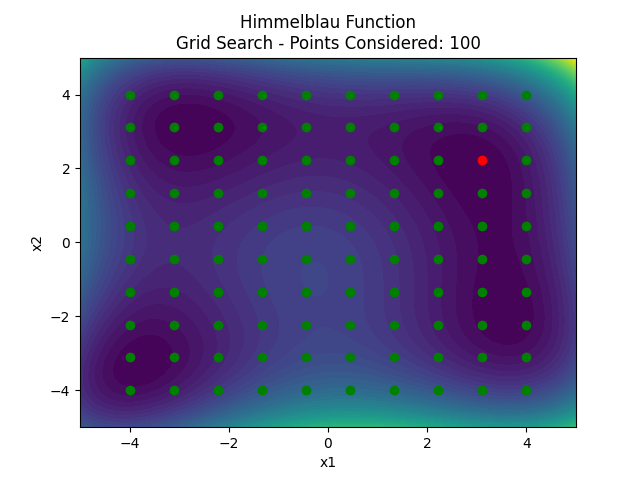
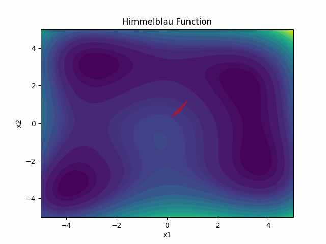
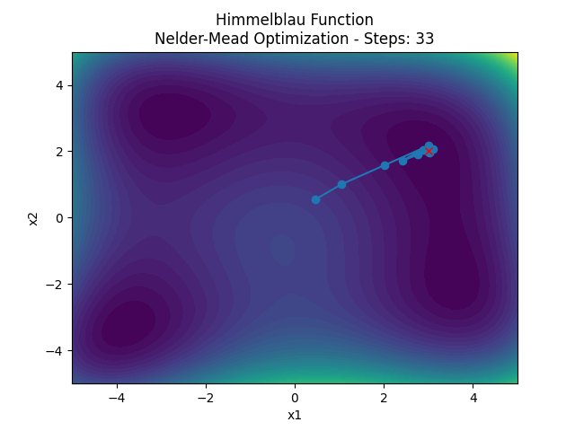
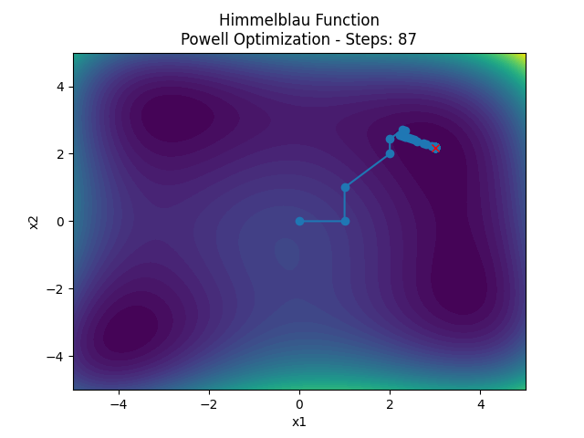
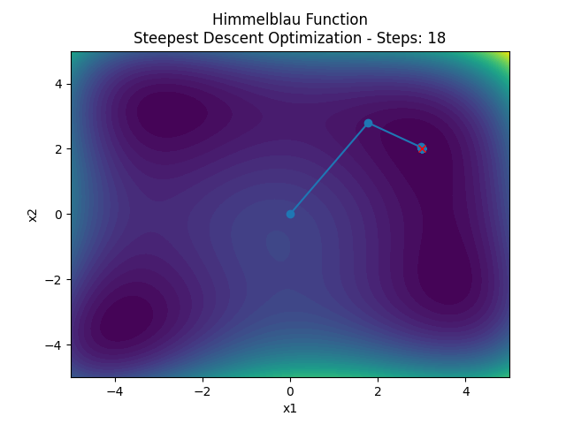
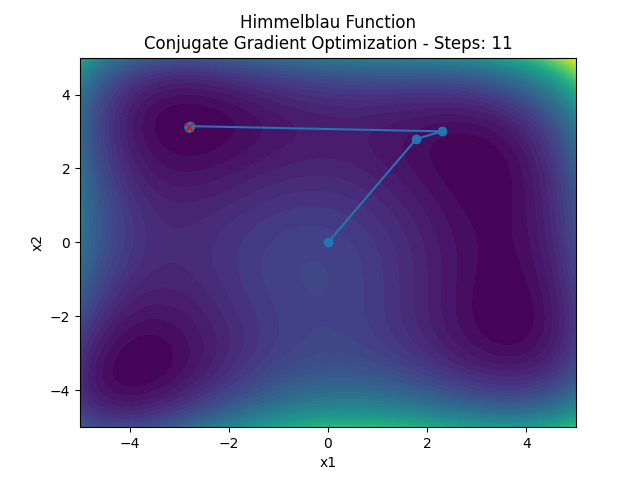
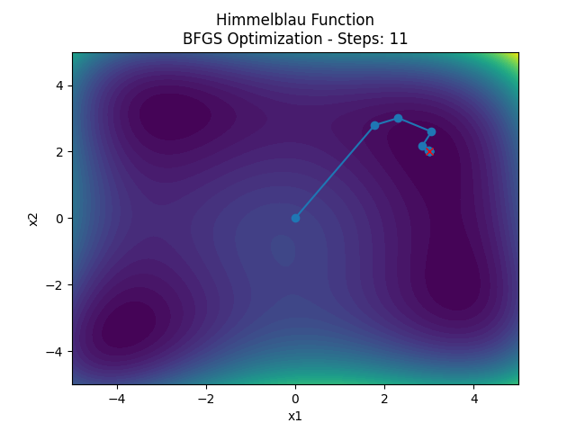

# Unconstrained Optimization Algorithms Visualization

This repository provides visualizations and animations of several unconstrained optimization algorithms applied to the Himmelblau function. The purpose is to illustrate how different optimization algorithms navigate the search space to find a minimum. This repository is intended to serve as an educational tool for those interested in learning about optimization algorithms and their behavior.

## Himmelblau Function

The Himmelblau function is a well-known test function for optimization algorithms. It has four local minima, making it a challenging problem for optimization methods. The function is defined as:

$$f(x_1, x_2) = (x_1^2 + x_2 - 11)^2 + (x_1 + x_2^2 - 7)^2\$$

The gradient of the Himmelblau function is given by:

For \( x_1 \):

$$
\frac{\partial f}{\partial x_1} = 2 \cdot (x_1^2 + x_2 - 11) \cdot 2x_1 + 2 \cdot (x_1 + x_2^2 - 7)
$$

For \( x_2 \):

$$
\frac{\partial f}{\partial x_2} = 2 \cdot (x_1^2 + x_2 - 11) + 2 \cdot (x_1 + x_2^2 - 7) \cdot 2x_2
$$

## Available Optimizers

### 1. **Grid Search**

Grid Search is a brute-force optimization algorithm that evaluates the objective function at a grid of points covering the search space. It is simple but computationally expensive, especially for higher dimensions.

### 2. **Nelder-Mead**

Nelder-Mead is a simplex-based optimization method that does not require gradient information. It is suitable for non-differentiable functions or when the gradient is expensive to compute.

 

### 3. **Powell's Method**

Powell's Method is a derivative-free optimization algorithm that iteratively refines the direction of search. It performs a series of line searches along each dimension to find the minimum.

### 4. **Steepest Descent**

The Steepest Descent method uses the gradient of the function to guide the search. It iteratively moves in the direction of the steepest descent (negative gradient) until convergence.

### 5. **Conjugate Gradient**

The Conjugate Gradient method is an optimization algorithm that combines the gradients from previous steps to converge faster than Steepest Descent. It is particularly effective for large-scale problems.

### 6. **BFGS (Broyden–Fletcher–Goldfarb–Shanno)**

BFGS is a popular quasi-Newton method that approximates the Hessian matrix of second derivatives to find the minimum. It balances speed and accuracy, making it one of the most widely used optimization methods.

